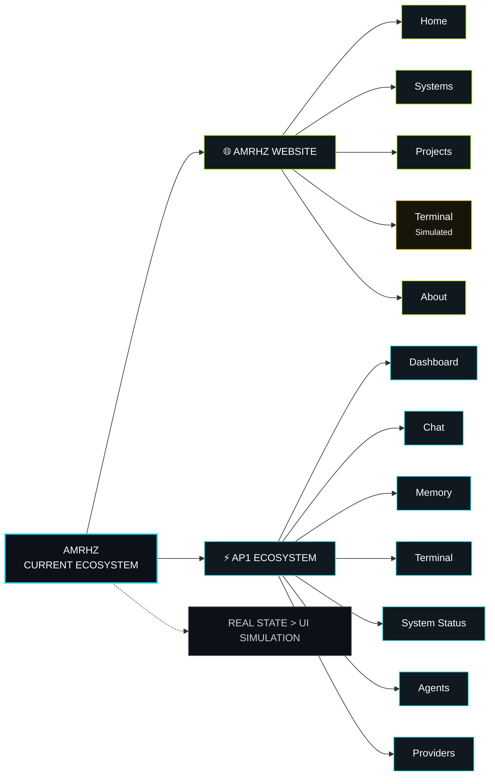

👋 AMRHZ — AI System Builder

<p align="center">
  
</p>
<p align="center">
  <a href="https://amrhz-websites.amirulhafiz1132002.workers.dev/"></a>
  <a href="https://preview--ap1-ecosystem.lovable.app/"></a>
  <a href="https://github.com/amirulhafiz1132002-code"></a>
</p>
<p align="center">
  <a href="https://github.com/amirulhafiz1132002-code"></a>
  <a href="https://amrhz-websites.amirulhafiz1132002.workers.dev/"></a>
</p>

«Building practical connections between Human + AI + Systems.»

---

🌐 AMRHZ Ecosystem

This profile is the central entry point to my public repositories, experiments, architecture work, and available web interfaces.

<p align="center">
  <a href="https://preview--ap1-ecosystem.lovable.app/">🚀 <strong>Open AP1 Ecosystem</strong></a> ·
  <a href="https://amrhz-websites.amirulhafiz1132002.workers.dev/">🌐 <strong>Official Website</strong></a> ·
  <a href="https://github.com/amirulhafiz1132002-code">💻 <strong>GitHub</strong></a>
</p>

🧩 Current Ecosystem



🔗 Quick Redirects

| Project | Status | Link |
|---|---|---|
| 🚀 AP1 Ecosystem | 🟢 Available | [Open AP1](https://preview--ap1-ecosystem.lovable.app/) |
| 🌐 AMRHZ Website | 🟢 Available | [Open Website](https://amrhz-websites.amirulhafiz1132002.workers.dev/) |
| 🧠 AMRHZ-AI-13 | 🟢 Repository | [View Repository](https://github.com/amirulhafiz1132002-code/AMRHZ-AI-13) |
| ⚡ AP1-WEB-Console | 🟢 Repository | [View Repository](https://github.com/amirulhafiz1132002-code/AP1-WEB-Console) |
| 🏗️ Architecture Core | 🟢 Repository | [View Repository](https://github.com/amirulhafiz1132002-code/amrhz-architecture-core) |

---

🧠 Human–AI Memory Bridge — Architectural Checkpoint

AMRHZ is documenting a proposed **Human–AI Memory Bridge**: a human-readable, inspectable state layer intended to preserve human intention, AI interpretation, decisions, assumptions, unknowns, evidence, failures, and verified real state across AI systems, sessions, applications, and devices.

**Status:** PROPOSED / LOCKED FOR DEVELOPMENT

Core flow:

```text
HUMAN INTENTION
      ↓
AI INTERPRETATION
      ↓
STRUCTURED SHARED STATE
      ↓
SYSTEM / AI ACTION
      ↓
REAL EVIDENCE
      ↓
HUMAN VERIFICATION
      ↓
UPDATED REAL STATE
```

Principles:

- **REAL STATE > UI SIMULATION**
- **HUMAN INTENTION > AI ASSUMPTION**
- **EVIDENCE > CLAIM**
- **VERIFICATION > BLIND TRUST**
- **FAILURE IS DATA**

This is an architectural direction, not a claim that the system is already implemented or scientifically proven.

📄 Full checkpoint: [docs/AMRHZ-HUMAN-AI-MEMORY-BRIDGE.md](docs/AMRHZ-HUMAN-AI-MEMORY-BRIDGE.md)

---

🧭 Current Project State

The ecosystem is being developed incrementally.

| Area | Current State |
|---|---|
| AMRHZ-AI-13 | 🟢 Existing prototype |
| CSV-based memory | 🟢 Existing |
| Intent detection | 🟢 Existing |
| Flask API foundation | 🟢 Existing |
| AP1 web ecosystem | 🟢 Existing |
| AP1-WEB-Console architecture | 🟢 Existing |
| Human-AI architecture documentation | 🟢 Existing |
| Larger orchestration system | 🟡 Development |
| Expanded persistent memory | 🟡 Development |
| Broader autonomous workflows | 🔵 Planned |

«Principle: show what exists first. Describe future capabilities separately.»

---

⭐ Featured Projects

🧠 AMRHZ-AI-13

An early AMRHZ AI system prototype.

The repository currently documents:

- CSV-based memory
- Intent detection
- Self-learning module
- Training scripts
- Flask API
- CLI agent execution

Repository: [github.com/amirulhafiz1132002-code/AMRHZ-AI-13](https://github.com/amirulhafiz1132002-code/AMRHZ-AI-13)

---

⚡ AP1-WEB-Console

A web-based AMRHZ / AP1 workspace repository containing documented layers for:

- Backend
- Frontend
- Memory
- Testing
- Dashboard interfaces
- System-oriented architecture

The repository also contains documented dashboard and telemetry-oriented pages.

Repository: [github.com/amirulhafiz1132002-code/AP1-WEB-Console](https://github.com/amirulhafiz1132002-code/AP1-WEB-Console)

---

🏗️ AMRHZ Architecture Core

A documentation and architecture repository focused on Human + AI collaboration.

It currently documents:

- Architectural layers
- Structural components
- Integration points
- Human-AI workflows
- Development patterns
- System organization

Repository: [github.com/amirulhafiz1132002-code/amrhz-architecture-core](https://github.com/amirulhafiz1132002-code/amrhz-architecture-core)

---

🚀 AP1 Ecosystem

A private AP1 ecosystem repository connected to the available AP1 web application.

Repository status: 🔒 Private  
Web interface: 🟢 Available

[Open AP1 Ecosystem](https://preview--ap1-ecosystem.lovable.app/)

---

🧠 What AMRHZ Is Building

The broader AMRHZ direction is an evolving AI-system workspace connecting:

```text
Human
  ↓
Development & Decision
  ↓
AMRHZ Projects
  ↓
AI Systems
  ↓
Memory / Interfaces / APIs
  ↓
Future Orchestration
```

This architecture is evolving.

Not every layer represented in the conceptual architecture is currently implemented as a complete production system.

---

🏗️ Architecture Principle

The development approach is based on:

**REAL STATE > UI SIMULATION**

That means:

- No fake system activity
- No invented status
- No unsupported capability claims
- No hidden execution
- No pretending planned features already exist
- Verify the implementation before calling it complete

---

🔐 Engineering Approach

Current development principles include:

- 🧩 Modular repositories
- 🔍 Inspect before changing
- 🧪 Test individual stages
- ✅ Verify results
- 📝 Document important changes
- 🔐 Keep secrets out of source code
- 🔄 Improve incrementally

Development Loop

```text
Understand
   ↓
Build
   ↓
Test
   ↓
Verify
   ↓
PASS
   ↓
Next Task
```

---

📊 GitHub Stats

<p align="center">
  
  
</p>

👁️ Profile Views

<p align="center">
  
</p>

---

🎯 Current Focus

🟢 Existing

- AMRHZ AI prototype
- CSV-based memory
- Intent detection
- Flask API foundation
- AP1 web ecosystem
- Human-AI architecture documentation

🟡 In Development

- Multi-agent architecture
- Stronger memory and retrieval systems
- Better system integration
- Expanded observability
- AP1 workspace evolution

🔵 Planned

- Broader orchestration
- More connected interfaces
- Expanded autonomous workflows
- Additional deployment paths

---

🛠️ Technologies Used Across Projects

The current repositories document the use of technologies including:

Frontend

HTML  
CSS  
JavaScript  
TypeScript

Backend

Python  
Flask  
Node.js

AI / Systems

AI APIs  
Agent systems  
Memory systems  
API-based integration

Infrastructure / Deployment

GitHub  
Cloudflare  
Web environments

«Technology usage varies by repository. This list represents technologies documented across the ecosystem rather than one single application stack.»

---

📦 AMRHZ-AI-13 — Basic Usage

```bash
git clone https://github.com/amirulhafiz1132002-code/AMRHZ-AI-13
cd AMRHZ-AI-13
pip install -r requirements.txt
python run.py
```

API

```bash
python api/api_server.py
```

Example endpoint:

```text
POST /chat
Content-Type: application/json
```

Example request:

```json
{
  "message": "build system"
}
```

«Usage details should always be checked against the repository's current implementation before running.»

---

🧭 Roadmap

Completed / Existing

- [x] AMRHZ AI prototype
- [x] CSV-based memory
- [x] Intent detection
- [x] Flask API foundation
- [x] AP1 web ecosystem foundation
- [x] Human-AI architecture documentation
- [x] Human–AI Memory Bridge architectural checkpoint

Development

- [ ] Expand multi-agent architecture
- [ ] Strengthen memory and retrieval
- [ ] Connect additional interfaces
- [ ] Improve observability
- [ ] Continue AP1 workspace development
- [ ] Design Human–AI Memory Bridge experiment

Future

- [ ] Broader system orchestration
- [ ] More autonomous workflows
- [ ] Additional cloud / desktop deployment paths

---

💡 Development Philosophy

«Build → Test → Verify → Improve → Repeat.»

Experiments, failures, discoveries, documentation, and working systems all contribute to the next iteration.

The goal is not to make the system look advanced.

The goal is to make the system actually work.

---

<p align="center">
  <strong>AMRHZ — Building the connection between Human + AI + Systems.</strong>
</p>