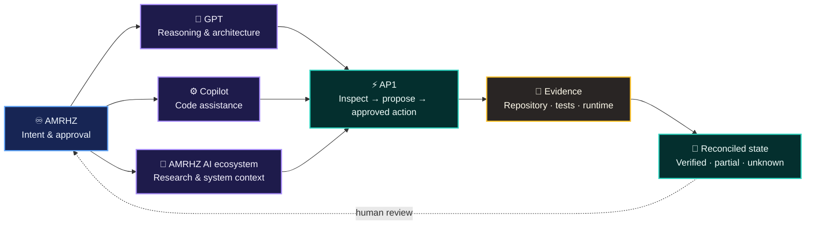

# ♾️ AMRHZ — AI Systems • AP1 • Human + AI

<p align="center"><strong>BUILD SYSTEMS, NOT JUST APPS.</strong><br/>Human intention × AI collaboration × verifiable systems</p>

<p align="center">
<a href="https://amrhz-websites.amirulhafiz1132002.workers.dev/"><strong>🌐 MAIN WEBSITE</strong></a> · 
<a href="https://preview--ap1-ecosystem.lovable.app/"><strong>⚡ AP1 WORKSPACE</strong></a> · 
<a href="https://github.com/amirulhafiz1132002-code/AP1-WEB-Console"><strong>🖥️ AP1-WEB-CONSOLE</strong></a>
</p>

<p align="center">
<a href="https://github.com/amirulhafiz1132002-code/AMRHZ-AI-13">🧠 AMRHZ-AI-13</a> · 
<a href="https://github.com/amirulhafiz1132002-code/amrhz-architecture-core">🏗️ ARCHITECTURE CORE</a> · 
<a href="https://github.com/amirulhafiz1132002-code">💻 GITHUB</a>
</p>

---

## 👋 WHO IS AMRHZ?

**Muhammad Amirul Hafiz (AMRHZ)** is an independent system developer building an ecosystem around **AI, APIs, software architecture, Human–AI collaboration, and verifiable runtime state**.

> The goal is not to make systems merely look intelligent. The goal is to make their underlying state inspectable, testable, understandable, and real.

### 🧭 ECOSYSTEM

```text
HUMAN INTENTION ↕ AI INTERPRETATION ↕ SHARED STATE
                         ↓
                 AP1 / SYSTEM ACTION
                         ↓
                   REAL EVIDENCE
                         ↓
                 HUMAN VERIFICATION
```

## 🤝 AI COLLABORATION — INTENT → ACTION → EVIDENCE

This is a collaboration model, not a claim that these agents are currently connected or active. GitHub README Mermaid renders a diagram; it does not run live animation. The flow below uses directional stages to make the handoffs easy to follow.


```mermaid
flowchart LR
    HUMAN["♾️ AMRHZ<br/>Intent & approval"]
    GPT["🧠 GPT<br/>Reasoning & architecture"]
    COPILOT["⚙️ Copilot<br/>Code assistance"]
    ECOSYSTEM["🔎 AMRHZ AI ecosystem<br/>Research & system context"]
    AP1["⚡ AP1<br/>Inspect → propose → approved action"]
    EVIDENCE["🧾 Evidence<br/>Repository · tests · runtime"]
    STATE["🧭 Reconciled state<br/>Verified · partial · unknown"]

    HUMAN --> GPT
    HUMAN --> COPILOT
    HUMAN --> ECOSYSTEM
    GPT --> AP1
    COPILOT --> AP1
    ECOSYSTEM --> AP1
    AP1 --> EVIDENCE
    EVIDENCE --> STATE
    STATE -. "human review" .-> HUMAN

    classDef human fill:#172554,stroke:#60a5fa,color:#eff6ff,stroke-width:2px
    classDef ai fill:#1e1b4b,stroke:#a78bfa,color:#f5f3ff,stroke-width:2px
    classDef system fill:#042f2e,stroke:#2dd4bf,color:#f0fdfa,stroke-width:2px
    classDef evidence fill:#292524,stroke:#fbbf24,color:#fffbeb,stroke-width:2px
    class HUMAN human
    class GPT,COPILOT,ECOSYSTEM ai
    class AP1,STATE system
    class EVIDENCE evidence
```

**Guardrails:** REAL STATE > UI SIMULATION · EVIDENCE > CLAIM · HUMAN INTENTION > AI ASSUMPTION · STATE RECONCILIATION > STATE ASSUMPTION · CHANGE BOUNDARY > UNCONTROLLED AUTONOMY · EVIDENCE CHAIN > ISOLATED RESULTS · NEGATIVE EVIDENCE MATTERS · REPOSITORY REALITY > REPOSITORY APPEARANCE · **INTENT → ACTION → EVIDENCE**

## 🗺️ LIVE ENVIRONMENT DEMO MAP

Use the links to inspect each destination. A link in this README does not prove that a service is reachable or that a feature works. Runtime status stays **UNKNOWN** until a current request/response or equivalent runtime evidence is recorded.

| Environment | Status | Demo / inspection |
|---|---|---|
| 🌐 AMRHZ Website | **UNKNOWN** — runtime not verified in this update | [Open website](https://amrhz-websites.amirulhafiz1132002.workers.dev/) · Public system hub |
| ⚡ AP1 Workspace | **UNKNOWN** — runtime not verified in this update | [Open workspace](https://preview--ap1-ecosystem.lovable.app/) · AP1 workspace preview |
| 🖥️ AP1-WEB-Console | **PARTIAL** — README records P0 tests 29/29 PASS; broader tests and CI pending. Runtime is **UNKNOWN**. | [Inspect repository](https://github.com/amirulhafiz1132002-code/AP1-WEB-Console) · Source and verification record |
| 🧠 AMRHZ-AI-13 | **DEVELOPMENT** — described as an early prototype; runtime is **UNKNOWN**. | [Inspect repository](https://github.com/amirulhafiz1132002-code/AMRHZ-AI-13) · Prototype source |
| 🏗️ Architecture Core | **UNKNOWN** — runtime/demo evidence not established here. | [Inspect repository](https://github.com/amirulhafiz1132002-code/amrhz-architecture-core) · Architecture and integration |

**State key:** **LIVE / VERIFIED** requires current runtime evidence; **PARTIAL** means only the named scope has evidence; **DEVELOPMENT** describes work in progress; **PROPOSED** is not implemented; **UNKNOWN** means evidence is insufficient. No environment is labeled LIVE / VERIFIED from a repository link alone.

## 🚀 START HERE

| Destination | Purpose |
|---|---|
| 🌐 [MAIN WEBSITE](https://amrhz-websites.amirulhafiz1132002.workers.dev/) | AMRHZ public system hub |
| ⚡ [AP1 WORKSPACE](https://preview--ap1-ecosystem.lovable.app/) | AP1 ecosystem workspace |
| 🖥️ [AP1-WEB-CONSOLE](https://github.com/amirulhafiz1132002-code/AP1-WEB-Console) | Main engineering console |
| 🧠 [AMRHZ-AI-13](https://github.com/amirulhafiz1132002-code/AMRHZ-AI-13) | Early AI prototype |
| 🏗️ [ARCHITECTURE CORE](https://github.com/amirulhafiz1132002-code/amrhz-architecture-core) | Architecture + integration |
| 💻 [GITHUB PROFILE](https://github.com/amirulhafiz1132002-code) | Source and public development |

## 🔐 AMRHZ CORE PROTOCOL

**REAL STATE > UI SIMULATION**  
**EVIDENCE > CLAIM**  
**HUMAN INTENTION > AI ASSUMPTION**  
**FAILURE IS DATA**

### Development lifecycle
`STABILIZE → VERIFY → CONNECT → EXTEND`

### Per-task lifecycle
`INSPECT → MINIMAL SAFE CHANGE → TEST → PASS → CHECKPOINT`

### Maturity
`CONCEPT → PROPOSED → PLANNED → DEVELOPMENT → PARTIAL → VERIFIED → LIVE`

Additional: `BLOCKED · DEPRECATED · UNKNOWN`

## 🧪 CURRENT ENGINEERING STATE

### AP1-WEB-Console — VERIFY

| Verification | State |
|---|---|
| P0 tests | ✅ **29/29 PASS** |
| Deprecation warnings | ⚠️ 3 observed |
| Remediation checkpoint | `97905d5` |
| Application logic changed by P0 remediation | ❌ No |
| Checkpoint working tree | ✅ CLEAN |
| Broader test suite | 🔎 Pending verification |
| CI state | 🔎 Pending verification |

**Next boundary:** verify broader tests and CI before CONNECT → EXTEND.

Full record: `docs/AMRHZ-CURRENT-STATE.md`

## 🧠 HUMAN–AI MEMORY BRIDGE

**Status: PROPOSED / LOCKED FOR DEVELOPMENT**

```text
INTENTION → INTERPRETATION → SHARED STATE
                 ↓
PROPOSAL → HUMAN APPROVAL → ACTION
                 ↓
REAL EVIDENCE → VERIFICATION → UPDATED STATE
```

## ⚡ AP1 ARCHITECTURE

- **GitHub** → source of truth for code, architecture, documentation, decisions, and history.
- **PostgreSQL** → runtime-state boundary for approvals, jobs, telemetry, and execution records.
- **AP1 flow** → Inspect → Propose → Approve / Cancel.
- **Evolution** → Health → Diagnostics → Missions → Agent Execution → Evaluation → Learning.

## 📡 SOCIAL / PUBLIC CHANNELS

| Channel | Public profile |
|---|---|
| ▶️ YouTube | [@AMRHZ13](https://www.youtube.com/@AMRHZ13) |
| 📸 Instagram | [@amrhz13](https://www.instagram.com/amrhz13) |
| 𝕏 X | [@AMRHZ9](https://x.com/AMRHZ9) |
| 📘 Facebook | [AMRHZ](https://www.facebook.com/share/1KiYVb1j4g/) |
| 💻 GitHub | [@amirulhafiz1132002-code](https://github.com/amirulhafiz1132002-code) |

**WhatsApp:** reserved for the public WhatsApp URL you choose to publish.

## 🧩 PROJECT MAP

| Project | Role | State |
|---|---|---|
| ⚡ AP1-WEB-Console | AP1 development console | 🔎 VERIFY |
| 🧠 AMRHZ-AI-13 | Early AI prototype | 🟢 Existing |
| 🏗️ Architecture Core | Architecture + integration | 🟢 Existing |
| 🌐 AMRHZ Website | Public ecosystem hub | 🌐 Deployed |
| 🧠 Human–AI Memory Bridge | Shared-state architecture | 🟡 Proposed |
| 🤖 Multi-agent orchestration | Agent expansion | 🟡 Development |
| 🧬 Enhanced memory/retrieval | Context + retrieval | 🔵 Planned |
| 🔄 Autonomous workflows | Future execution layer | 🔵 Planned |

## 🛠️ TECHNOLOGY

**Frontend:** HTML · CSS · JavaScript · TypeScript · React  
**Backend:** Python · FastAPI · Flask · Node.js  
**AI / Systems:** AI APIs · agent architectures · memory/context · API integration  
**Infrastructure:** GitHub · Cloudflare Workers · deployment platforms · PostgreSQL runtime-state direction

## 🗺️ ROADMAP

- ✅ Foundation: prototypes, architecture, website, AP1 ecosystem, evidence-first protocol
- 🔎 Current: broader tests, CI verification, runtime-state validation, observability
- 🧬 Future: mission execution, multi-agent orchestration, evaluation, learning, expanded integrations

## ♾️ AMRHZ PHILOSOPHY

> **REAL STATE > UI SIMULATION**  
> **EVIDENCE > CLAIM**  
> **HUMAN INTENTION > AI ASSUMPTION**

**Build → Test → Verify → Improve → Repeat.**

<p align="center"><strong>♾️13 AMRHZ</strong><br/><sub>Human × AI × Systems</sub><br/><br/><a href="https://amrhz-websites.amirulhafiz1132002.workers.dev/">MAIN WEBSITE</a> · <a href="https://preview--ap1-ecosystem.lovable.app/">AP1 WORKSPACE</a> · <a href="https://github.com/amirulhafiz1132002-code/AP1-WEB-Console">AP1 PROJECT</a></p>