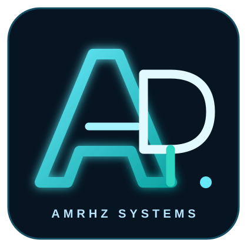
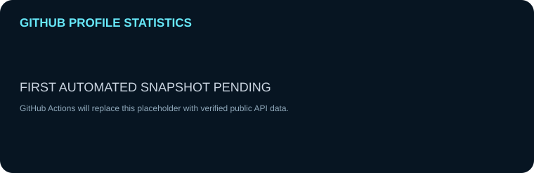
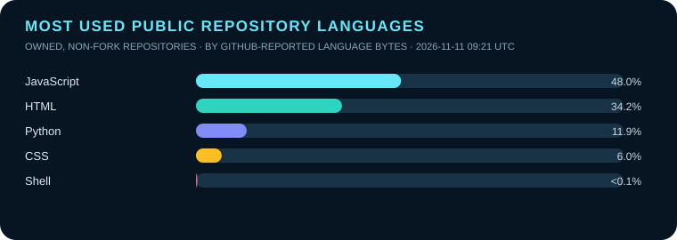

# ♾️ AMRHZ — Human × AI × Systems

<p align="center">
  
</p>

<p align="center">
  
</p>

<p align="center">
  <strong>HUMAN-DIRECTED SYSTEMS · MODULAR AI · EVIDENCE-FIRST ENGINEERING</strong><br/>
  <em>Build systems, not just apps.</em>
</p>

<p align="center">
  <a href="https://amrhz-websites.amirulhafiz1132002.workers.dev/"><strong>↗ MAIN WEBSITE</strong></a> ·
  <a href="https://preview--ap1-ecosystem.lovable.app/"><strong>↗ AP1 WORKSPACE</strong></a> ·
  <a href="https://github.com/amirulhafiz1132002-code/AP1-WEB-Console"><strong>↗ ENGINEERING CONSOLE</strong></a>
</p>
<p align="center">
  <a href="https://github.com/amirulhafiz1132002-code/AMRHZ-AI-13">AMRHZ-AI-13</a> ·
  <a href="https://github.com/amirulhafiz1132002-code/amrhz-architecture-core">Architecture Core</a> ·
  <a href="https://github.com/amirulhafiz1132002-code">Repository Index</a>
</p>

<p align="center">
  
  
  
</p>

---

## ◈ 01 / LIVE PROFILE SIGNALS

<p align="center">
  
  
  
  
</p>

<p align="center">
  <a href="https://github.com/amirulhafiz1132002-code/amirulhafiz1132002-code/actions/workflows/eslint.yml">
    
  </a>
  
</p>

<p align="center">
  
</p>

<p align="center">
  
</p>

> **Counter and telemetry note:** Profile views, followers, visible stars, repository size, and commit time are GitHub or third-party badge data. The two statistics cards are generated as repository-hosted SVG files from GitHub's public API by GitHub Actions, with a daily refresh schedule and updates when their source changes. They reflect public repository data only and are not AP1 runtime telemetry. The CI badge reports only the linked profile workflow.

## ◈ 02 / AP1 COMMAND DECK

### ◈ 01 — PUBLIC HUB
AMRHZ public identity and ecosystem entry point.

[OPEN MAIN WEBSITE ↗](https://amrhz-websites.amirulhafiz1132002.workers.dev/)

### ◈ 02 — AP1 WORKSPACE
Workspace preview and product direction.

[OPEN AP1 WORKSPACE ↗](https://preview--ap1-ecosystem.lovable.app/)

### ◈ 03 — ENGINEERING CONSOLE
AP1 source, tests, and engineering checkpoints.

[INSPECT SOURCE ↗](https://github.com/amirulhafiz1132002-code/AP1-WEB-Console)

### ◈ 04 — AMRHZ AI 13
AI prototype, runtime experiments, and integration work.

[INSPECT PROJECT ↗](https://github.com/amirulhafiz1132002-code/AMRHZ-AI-13)

### ◈ 05 — ARCHITECTURE CORE
System architecture and integration foundations.

[INSPECT ARCHITECTURE ↗](https://github.com/amirulhafiz1132002-code/amrhz-architecture-core)

### ◈ 06 — TOOL REGISTRY
Evidence-based inventory of tools and technologies.

[READ REGISTRY ↗](docs/AMRHZ-TOOL-REGISTRY.md)

<p align="center">
  <sub>Navigation is not a health check. A working link does not prove a destination is LIVE or VERIFIED.</sub>
</p>

## ◈ 03 / ENGINEERING IDENTITY

I explore AI systems, APIs, software architecture, and Human–AI collaboration with a focus on making system behavior inspectable rather than merely impressive.

<p align="center">
  <strong>INTENT</strong> → <strong>ACTION</strong> → <strong>EVIDENCE</strong> → <strong>VERIFIED STATE</strong>
</p>

**Engineering principles**

- `REAL STATE > UI SIMULATION`
- `EVIDENCE > CLAIM`
- `HUMAN INTENTION > AI ASSUMPTION`
- `STATE RECONCILIATION > STATE ASSUMPTION`
- `CHANGE BOUNDARY > UNCONTROLLED AUTONOMY`
- `EVIDENCE CHAIN > ISOLATED RESULTS`
- `NEGATIVE EVIDENCE MATTERS`
- `REPOSITORY REALITY > REPOSITORY APPEARANCE`

### REAL STATE × GEN Z × EVIDENCE

**EVERYBODY COULD EVOLVE.**

A proposed Human–AI Collaboration Protocol for making complex work understandable without sacrificing accuracy, helping people explore nonlinear ideas without losing workflow state, and separating ideas from tested and verified results.

- **REAL STATE:** describe what actually exists.
- **GEN Z:** adapt explanations to the person; simplify the language, not the evidence.
- **EVIDENCE:** distinguish ideas, tests, verified results, and accomplished system state.

The protocol is a documented direction, **not a claim that every capability is already implemented**.

[Read the Human–AI Collaboration Protocol ↗](https://github.com/amirulhafiz1132002-code/AMRHZ-AI-13/blob/main/docs/HUMAN_AI_COLLABORATION_PROTOCOL.md)

## ◈ 04 / SYSTEM MATURITY

| State | Meaning |
|---|---|
| **CONCEPT** | Direction or visual idea; not implemented |
| **PROPOSED / PLANNED** | Defined direction; implementation not yet established |
| **DEVELOPMENT / PARTIAL** | Work exists, but scope or behavior is incomplete |
| **VERIFIED** | A defined behavior passed a relevant test with inspectable evidence |
| **LIVE** | Current runtime evidence confirms the specified service is operating |
| **BLOCKED** | A known dependency or failure prevents progress |
| **UNKNOWN** | Evidence is missing, stale, or insufficient |

A passing test proves only what that test covers. A successful build does not by itself prove deployment health. A model listed in a plan is not necessarily connected or running.

## ◈ 05 / ENGINEERING CONSOLE

A compact view of the operating model — illustrative documentation, not an executable AP1 terminal.

```text
┌──────────────────────────────────────────────────────┐
│  AMRHZ / AP1 ENGINEERING CONSOLE                      │
├──────────────────────────────────────────────────────┤
│  OWNER       Human authority                          │
│  AI ROLE     Research · Design · Code · Review        │
│  CONTROL     Scoped · Approved · Auditable            │
│  METHOD      AUDIT → PRIORITIZE → EXECUTE → VERIFY    │
│  PRIORITY    Real state · Evidence · Reconciliation   │
└──────────────────────────────────────────────────────┘
```

<details>
<summary><strong>Human–AI collaboration & bounded execution</strong></summary>

The human owner defines intent, scope, permissions, approval requirements, and interpretation of results. AI tools can contribute research, planning, coding, review, and verification support; they are not assumed to be continuously connected or authorized to act.

```text
HUMAN INTENT
    ↓
INTERPRET / PLAN
    ↓
SELECT SCOPED MODULE
    ↓
PROPOSE → APPROVE → ACT
    ↓
OBSERVE RESULT
    ↓
COLLECT EVIDENCE → VERIFY → RECONCILE STATE
```

- Intent ≠ action
- Action ≠ successful result
- Result ≠ verified state
- Available model ≠ connected model
- Planned capability ≠ implemented capability

The long-term direction is modular, provider-flexible orchestration. Actual provider availability depends on credentials, API access, compatibility, runtime configuration, cost, latency, and policy.

</details>

<details>
<summary><strong>Project checkpoints & evidence notes</strong></summary>

| Project / environment | Recorded stance | Evidence destination |
|---|---|---|
| AMRHZ public website | **UNKNOWN** — runtime not checked in this profile update | [Open website](https://amrhz-websites.amirulhafiz1132002.workers.dev/) |
| AP1 workspace preview | **UNKNOWN** — preview availability is not a health guarantee | [Open workspace](https://preview--ap1-ecosystem.lovable.app/) |
| AP1-WEB-Console | **DEVELOPMENT / VERIFY** — inspect CI and runtime separately | [Source](https://github.com/amirulhafiz1132002-code/AP1-WEB-Console) |
| AMRHZ-AI-13 | **DEVELOPMENT** — prototype maturity; no live claim here | [Source](https://github.com/amirulhafiz1132002-code/AMRHZ-AI-13) |
| Termux workstation | **DEVELOPMENT / PARTIAL** — tools found; editor and watcher integration not verified | [Audit checkpoint](docs/AMRHZ-CURRENT-STATE.md#termux-development-workstation-checkpoint--2026-10-20) |
| Architecture Core | **UNKNOWN** — current integration state not established here | [Source](https://github.com/amirulhafiz1132002-code/amrhz-architecture-core) |
| Human–AI Memory Bridge | **PROPOSED** — direction, not a verified shared-memory service | [Tool registry](docs/AMRHZ-TOOL-REGISTRY.md) |

**AMRHZ-AI-13 — recorded test checkpoint (2026-10-19):** A controlled Termux/Android test loaded the cached external `HuggingFaceTB/SmolLM2-135M-Instruct` base model through `ModelRuntime`; `AutoPilot` called the runtime and returned the non-empty response `Hello!`. Eight targeted runtime/integration/regression tests passed (`8 passed in 0.06s`). SHA-256 checks confirmed `data/brain_v2.csv` and `data/autopilot_history.csv` were unchanged during that run. **Qualification:** the returned AutoPilot result still had `success: false` because CSV candidate confidence was 50%, below the 60% threshold; that flag reflects candidate scoring, not evaluation of the generated response. The run required a process-scoped `LD_PRELOAD` workaround for the `tokenizers` import issue. Permanent linker remediation, broader evaluation, AMRHZ-owned trained weights, and LIVE status remain **unverified**. This establishes a tested integration path—not a completed or independently trained AMRHZ model.

**Termux workstation — recorded audit checkpoint (2026-10-20):** A read-only environment audit identified Neovim, Tree-sitter, `clangd`, `inshellisense`, Git, Python, and Node.js. Standard file-watcher commands and several language-server commands were not found through the checked PATH/package queries. This does not prove equivalent tools are absent elsewhere. Editor integration, shell suggestion behavior, language-server functionality, and file watching remain **unverified**. No Termux configuration changes were made during that audit.

These are documented checkpoints, not automatic runtime probes. Re-check linked evidence before relying on them.

</details>

<details>
<summary><strong>Engineering lifecycle, security & roadmap</strong></summary>

**Lifecycle:** `STABILIZE → VERIFY → CONNECT → EXTEND`

**One-task loop:** `INSPECT → MINIMAL SAFE CHANGE → TEST → PASS → CHECKPOINT`

- [AMRHZ Tool Registry](docs/AMRHZ-TOOL-REGISTRY.md)
- [Security Policy](SECURITY.md)
- [Profile repository commit history](https://github.com/amirulhafiz1132002-code/amirulhafiz1132002-code/commits/Amrhz/)

**Technology areas:** HTML · CSS · JavaScript · TypeScript · React · Python · FastAPI · Flask · Node.js · AI APIs · GitHub Actions · Cloudflare Workers · data and state architecture.

**Roadmap direction**
- **Foundation:** establish prototypes, architecture, and reliable engineering checkpoints.
- **Current priority:** verification, CI integrity, runtime-state validation, and observability.
- **Future exploration:** bounded task execution, multi-agent coordination, evaluation, memory, and integrations.

These are areas and directions—not a claim that every technology is deployed or connected.

</details>

<details>
<summary><strong>Public channels</strong></summary>

- [YouTube · @AMRHZ13](https://www.youtube.com/@AMRHZ13)
- [Instagram · @amrhz13](https://www.instagram.com/amrhz13)
- [X · @AMRHZ9](https://x.com/AMRHZ9)
- [Facebook · AMRHZ](https://www.facebook.com/share/1KiYVb1j4g/)
- [GitHub · @amirulhafiz1132002-code](https://github.com/amirulhafiz1132002-code)

</details>

---

<p align="center">
  <strong>♾️13 AMRHZ × AP1</strong><br/>
  Human × AI × Systems<br/>
  <sub>Build → Test → Verify → Improve → Repeat.</sub>
</p>
